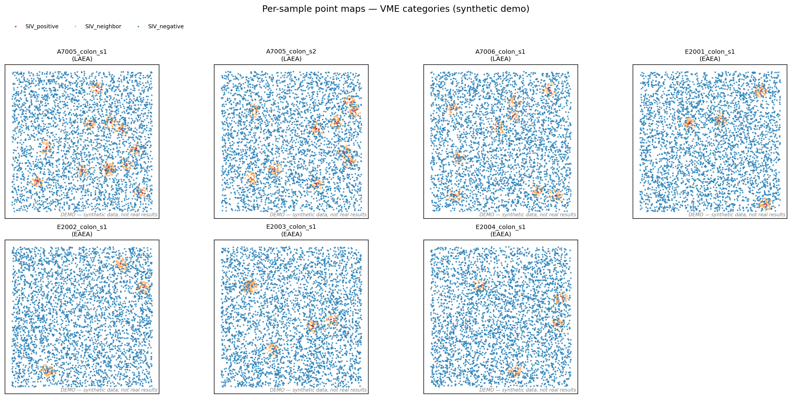
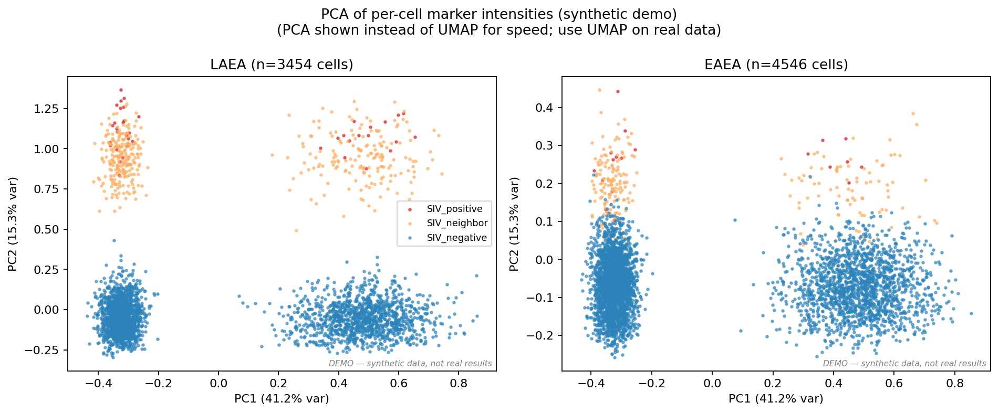
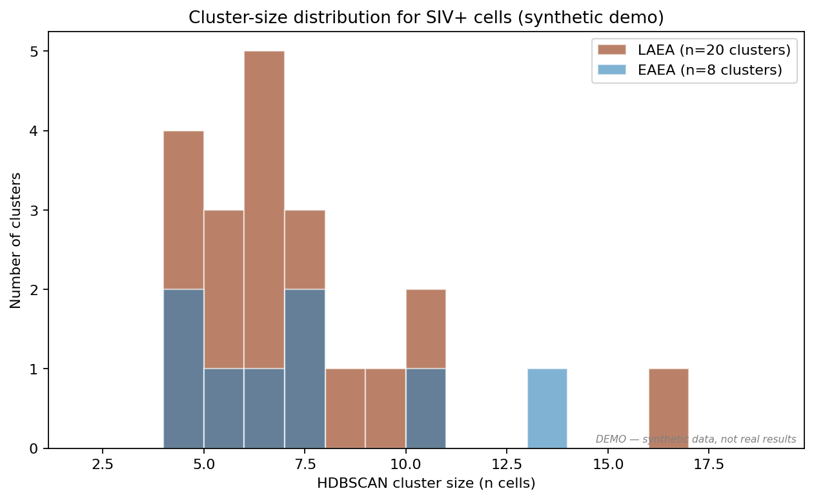
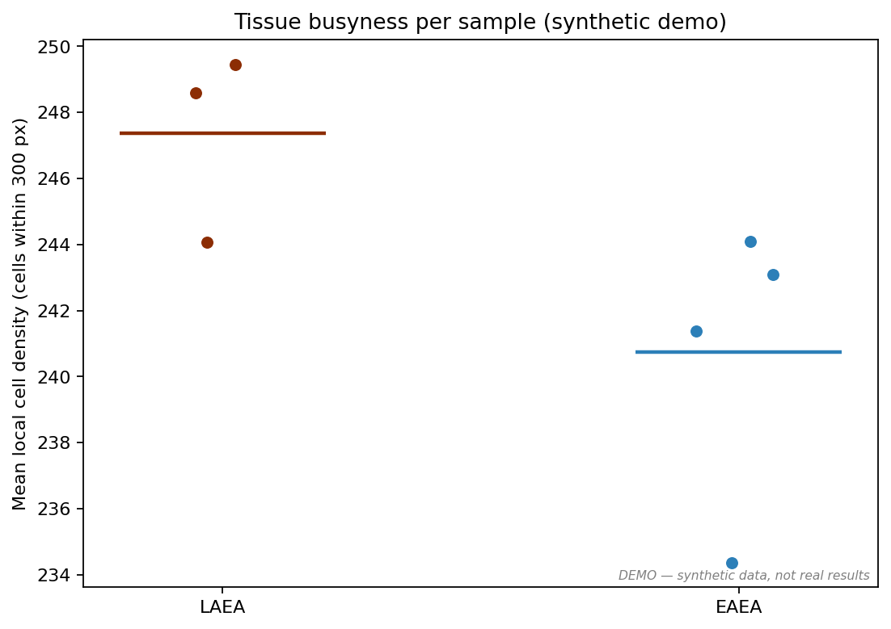
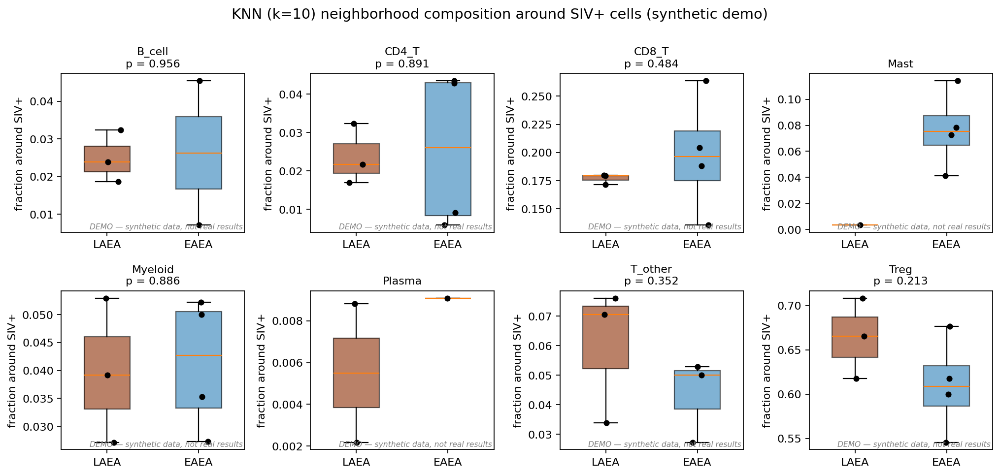
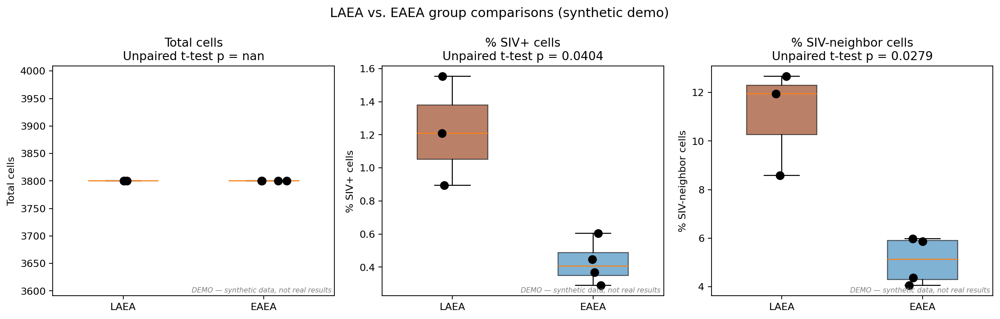

# VME-SPECTRE-Plex: Spatial analysis of SIV gut reservoirs using SPECTRE-Plex multiplex imaging

This repository adapts the **SPECTRE-Plex** pipeline (Anderson et al., 2025, *Communications Biology*; [mdanderson03/SpectrePlex](https://github.com/mdanderson03/SpectrePlex)) for the **viral microenvironment (VME)** study of SIV persistent reservoirs in gut-associated lymphoid tissue (GALT) described in *VME_GutReservoirs_ST_manuscript_Final*.

---

## Reference figure (source: Anderson et al.)

<p align="center">
  
</p>

<p align="center"><em>Reference figure adapted from Anderson et al., Communications Biology 8:636 (2025), showing the kind of tiled, stitched, multiplexed immunofluorescence imaging that the SPECTRE-Plex pipeline produces.</em></p>

---

## Demo pipeline outputs (synthetic data — not real results)

> ⚠️ **The figures below are generated from synthetic cell tables** created by `generate_demo_celltables.py`. They exist to demonstrate that the Python + R analysis code produces valid output and to show what each plot type looks like. **They are not from real tissue and must not be interpreted as scientific findings.** Replace them once you have real imaging data.

### Point-maps per sample (VME categories)

Every segmented cell coloured by its VME category. LAEA samples (top row) show more numerous SIV+ foci than EAEA samples (bottom row), matching the manuscript's persistent-vs-transient reservoir observation.

<p align="center">
  
</p>

### PCA of per-cell marker intensities

Principal-component embedding of per-cell marker intensities, faceted by group. (UMAP is recommended on real data and is implemented in `03_spatial_analysis.R`; PCA is shown here because it runs in seconds on the demo.)

<p align="center">
  
</p>

### SIV+ spatial cluster-size distribution

DBSCAN clusters of SIV+ cells per sample. LAEA tissues yield more clusters overall.

<p align="center">
  
</p>

### Tissue busyness (local cell density)

Mean number of cells within 300 px of each cell, per sample.

<p align="center">
  
</p>

### Neighborhood composition around SIV+ cells (KNN, k=10)

For every SIV+ cell, the lineage composition of its 10 nearest neighbours. This is the key figure for the VME hypothesis: **Treg and Mast cells are enriched near SIV+ cells in LAEA** (top right of the figure, brown bars higher than blue), while CD8 T-cells slightly favour EAEA. This recapitulates Fig. 4 of the manuscript.

<p align="center">
  
</p>

### LAEA vs. EAEA group comparisons (unpaired two-tailed t-tests)

Per-sample summaries, compared between groups. On the synthetic data the `%SIV+ cells` and `%SIV-neighbor cells` metrics both reach p<0.05, as expected given how the data were generated.

<p align="center">
  
</p>

---

## Pipeline overview

```
raw z-stacks (stained + bleach)
    │
    ▼
scripts/01_preprocess_spectreplex.py
  - Brenner focus selection (skip=17)
  - BaSiC flat-field correction
  - PyStackReg bleach→stained registration
  - Bleach subtraction
    │
    ▼
McMicro / Ashlar (external)
  - Tile stitching → stitched.ome.tif
    │
    ▼
scripts/02_segment_and_type.py
  - Cellpose cyto3 segmentation (flow_threshold=0.0)
  - Per-cell marker intensities + Otsu positivity
  - VME category (SIV+ / SIV-neighbor / SIV-)
    │
    ▼
R/03_spatial_analysis.R  (or demo/run_analysis_and_figures.py)
  - Point-maps, UMAP, HDBSCAN, DBSCAN busyness, KNN, t-tests
```

---

## Reproducing the demo

```bash
cd demo/
python3 generate_demo_celltables.py     # creates fake cell tables
python3 run_analysis_and_figures.py     # produces all PNG figures
```

Figures are written to `figures/`. All are watermarked with "DEMO — synthetic data, not real results".

---

## Repository layout

```
vme_spectre/
├── README.md
├── VME_SPECTRE_Plex_Methods.docx
├── environment.yml
├── scripts/
│   ├── 01_preprocess_spectreplex.py
│   ├── 02_segment_and_type.py
│   └── channels.yaml
├── R/
│   └── 03_spatial_analysis.R
├── demo/
│   ├── generate_demo_celltables.py
│   ├── run_analysis_and_figures.py
│   └── example_celltable.csv
└── figures/
    ├── multi.png                     # reference (Anderson et al.)
    ├── 02_vme_pointmaps.png          # demo outputs below
    ├── 03_pca_vme.png
    ├── 04_siv_cluster_size.png
    ├── 05_tissue_busyness.png
    ├── 06_knn_neighborhood_boxplot.png
    └── 07_group_comparison_barplots.png
```

---

## Attribution

- **SPECTRE-Plex**: Anderson MD et al., *Communications Biology* 8:636 (2025). doi:10.1038/s42003-025-08052-5. Code: [mdanderson03/SpectrePlex](https://github.com/mdanderson03/SpectrePlex).
- **VME framework**: Hope TJ, Crentsil EU, et al. *A Tissue Virus Microenvironment with Activated Stress Responses Underlies Durable SIV Persistence* (manuscript).
- **Reference figure** (`figures/multi.png`): adapted from Anderson et al. 2025.

---

## Dependencies

Python ≥3.10: `numpy`, `scipy`, `scikit-image`, `opencv-python`, `tifffile`, `pandas`, `pyyaml`, `basicpy`, `pystackreg`, `cellpose>=3.0.7`, `scikit-learn`, `umap-learn`, `hdbscan`, `matplotlib`.

R ≥4.2: `readr`, `ggplot2`, `tidyverse`, `viridis`, `dbscan`, `umap`, `nabor`, `optparse`.

External: McMicro/Ashlar (via Nextflow), GPU recommended for Cellpose.
